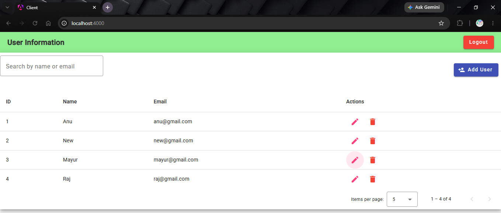
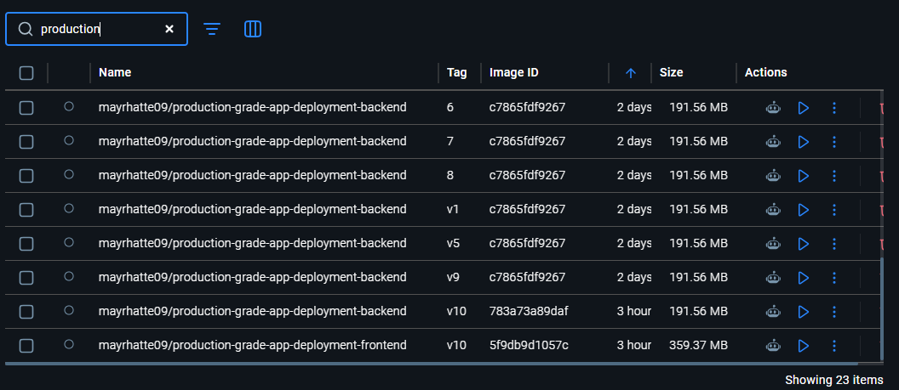
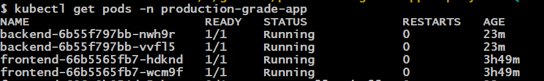
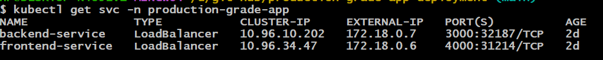
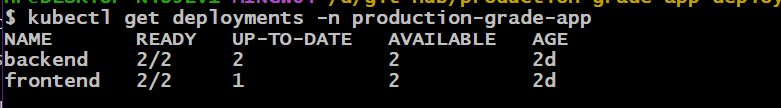
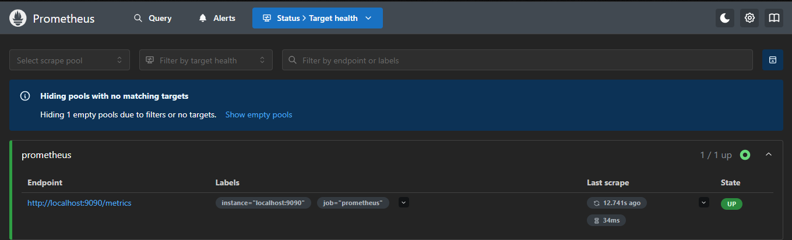
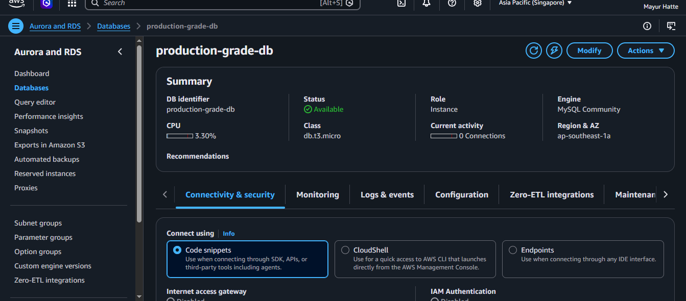

#  Production Grade Application Deployment

```{=html}
<p align="center">
```
An end-to-end DevOps project demonstrating CI/CD, containerization,
Kubernetes deployment, AWS RDS integration, and monitoring with
Prometheus & Grafana.
```{=html}
</p>
```
##  Project Overview

This project automates the deployment of a full-stack application using
modern DevOps practices.

### Tech Stack

  Category         Technology
  ---------------- ---------------------
  Frontend         Angular
  Backend          Node.js
  Database         MySQL (AWS RDS)
  CI/CD            Jenkins
  Containers       Docker
  Registry         Docker Hub
  Orchestration    Kubernetes
  Monitoring       Prometheus, Grafana
  Source Control   Git & GitHub

------------------------------------------------------------------------

#  Architecture


------------------------------------------------------------------------

# 📂 Repository Structure

``` text
production-grade-app-deployment/
├── Backend/
├── Frontend/
├── kubernetes/
├── monitoring/
├── images/
├── Jenkinsfile
├── README.md
└── LICENSE
```

------------------------------------------------------------------------

# 🔄 CI/CD Workflow

``` text
Developer
    │
    ▼
GitHub Repository
    │
    ▼
Jenkins Pipeline
    │
    ├── Checkout Code
    ├── Build Docker Images
    ├── Push Images to Docker Hub
    ├── Deploy to Kubernetes
    └── Verify Deployment
           │
           ▼
 Kubernetes Cluster
      │          │
      ▼          ▼
 Frontend     Backend
                  │
                  ▼
             AWS RDS MySQL

Prometheus → Grafana
```

------------------------------------------------------------------------

# ☸️ Kubernetes Resources

-   Namespace
-   Backend Deployment
-   Backend Service
-   Frontend Deployment
-   Frontend Service
-   ConfigMap
-   Secret
-   Ingress

------------------------------------------------------------------------

#  Monitoring

Prometheus collects metrics from the Kubernetes cluster.

Grafana visualizes CPU, Memory, Pod status and application metrics.

------------------------------------------------------------------------

# Screenshots

## Application



## Jenkins Pipeline


## Docker Images



## Kubernetes Pods



## Kubernetes Services



## Deployments



## Prometheus



## Grafana


## AWS RDS



------------------------------------------------------------------------

#  Getting Started

## Clone Repository

``` bash
git clone https://github.com/Mayurhatte09/production-grade-app-deployment.git
cd production-grade-app-deployment
```

## Build Images

``` bash
docker build -t mayrhatte09/production-grade-app-deployment-backend Backend
docker build -t mayrhatte09/production-grade-app-deployment-frontend Frontend
```

## Deploy

``` bash
kubectl apply -f kubernetes/
kubectl apply -f monitoring/
```

------------------------------------------------------------------------

#  Configuration

Application configuration is managed using:

-   Kubernetes ConfigMap
-   Kubernetes Secret

Sensitive database credentials are **not hardcoded** in the application.

------------------------------------------------------------------------

# Features

-   Jenkins CI/CD Pipeline
-   Docker Image Build & Push
-   Kubernetes Deployments
-   Rolling Updates
-   AWS RDS Integration
-   ConfigMap & Secret
-   Ingress
-   Prometheus Monitoring
-   Grafana Dashboards
-   Production-ready project structure

------------------------------------------------------------------------

# Future Improvements

-   Helm Charts
-   Argo CD (GitOps)
-   SonarQube
-   Trivy Security Scanning
-   Terraform Infrastructure
-   AWS EKS Deployment
-   Horizontal Pod Autoscaler

------------------------------------------------------------------------

# 👤 Author

<table align="center">
<tr>
<td align="center" width="160">

</td>
<td>
<strong>Mayur Hatte</strong>


<em>DevOps & Cloud Infrastructure Engineer</em>


Focused on building self-healing, automated infrastructure. This playbook is a verified asset of <strong>MayurHatte09</strong>.
</td>
</tr>
</table>

<div align="center">
<sub>© 2026 | Mayur Hatte Design System</sub>

---


